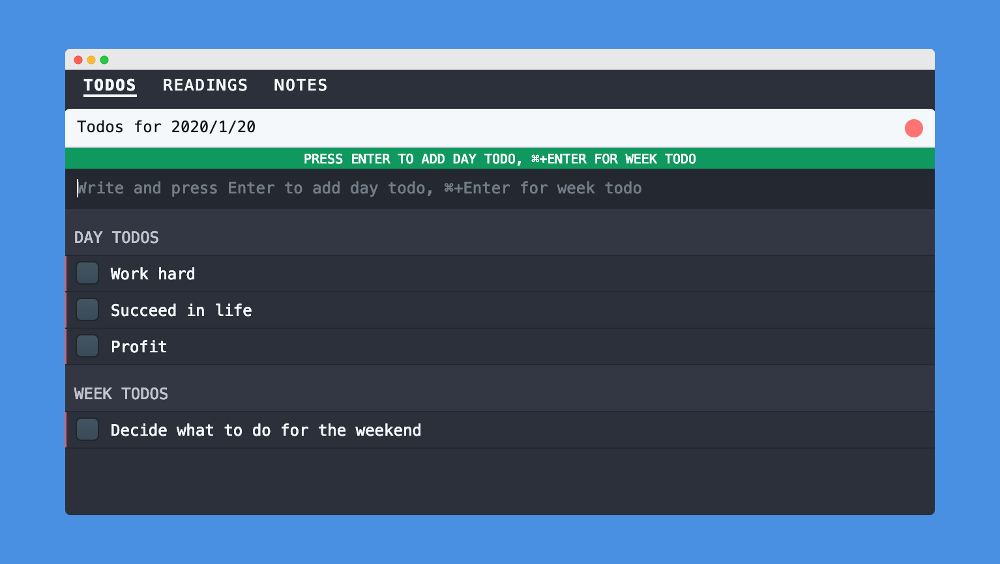

# toolkit

Toolkit is a set of tools that help my day job.



## Install

Clone the repository with Git:

```bash
git clone git@github.com:suchanlee/toolkit.git
```

And then install the dependencies:

```bash
cd toolkit
yarn
```

## Usage
Both processes have to be started **simultaneously** in different console tabs:

```bash
npm run start-renderer-dev
npm run start-main-dev
```

This will start the application with hot-reload so you can instantly start developing your application.

You can also run do the following to start both in a single process:

```bash
npm run start-dev
```

## Packaging
We use [Electron builder](https://www.electron.build/) to build and package the application. By default you can run the following to package for your current platform:

```bash
npm run dist
```

This will create a installer for your platform in the `releases` folder.

You can make builds for specific platforms (or multiple platforms) by using the options found [here](https://www.electron.build/cli). E.g. building for all platforms (Windows, Mac, Linux):

```bash
npm run dist -- -mwl
```

# Keyboard Shortcuts

| Description          | Keyboard    |
| -------------------- | ----------- |
| Go to "TODOS" Tab    | Cmd + 1     |
| Go to "READINGS" Tab | Cmd + 2     |
| Go to "NOTES" Tab    | Cmd + 3     |


## TODOS Tab

| Description                                                                    | Keyboard    |
| ------------------------------------------------------------------------------ | ----------- |
| Navigate between todos                                                         | Up/Down     |
| Rotate the todo state of the current item (todo -> in progress -> finished)    | Enter       |

## READINGS Tab

| Description          | Keyboard    |
| -------------------- | ----------- |
| Open a page          | Cmd + Enter |

## NOTES Tab

